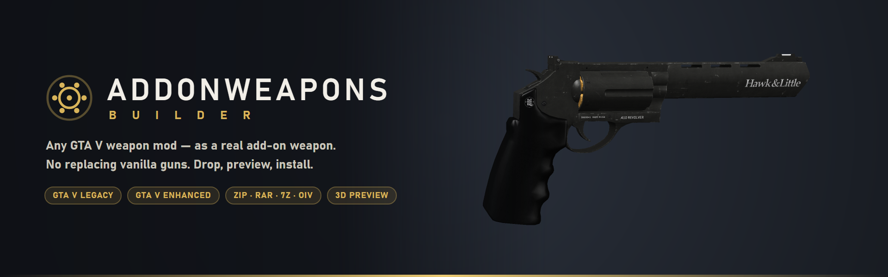
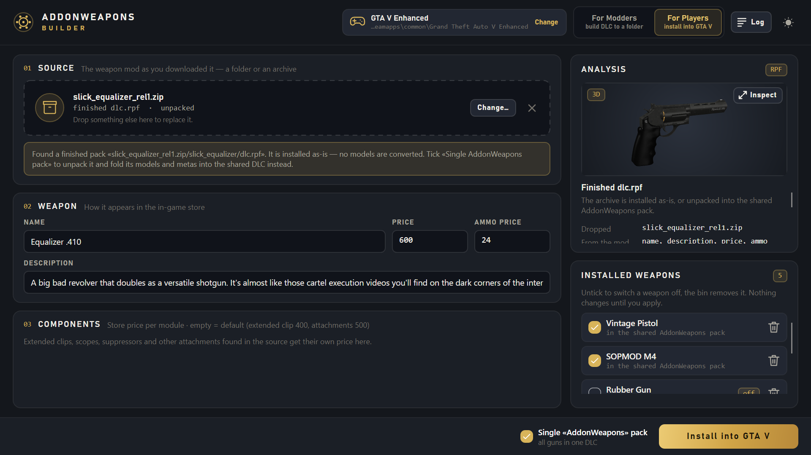
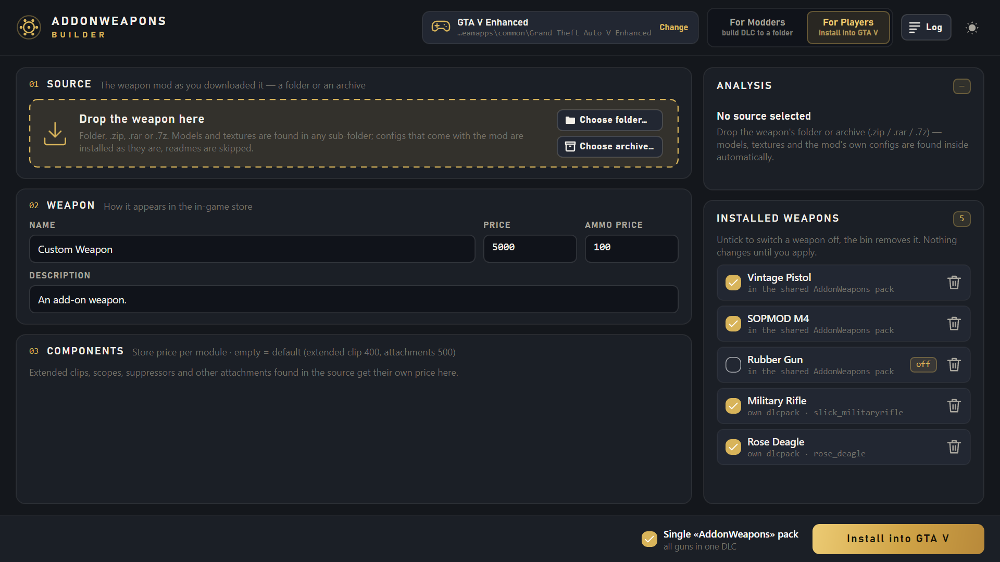
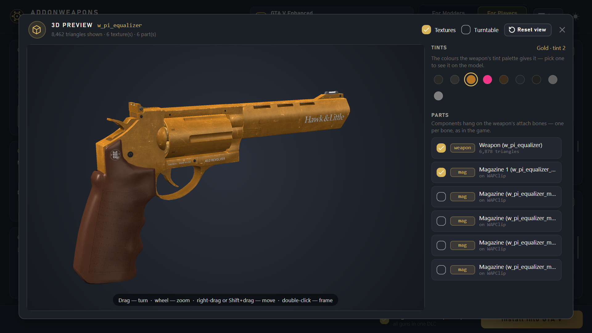
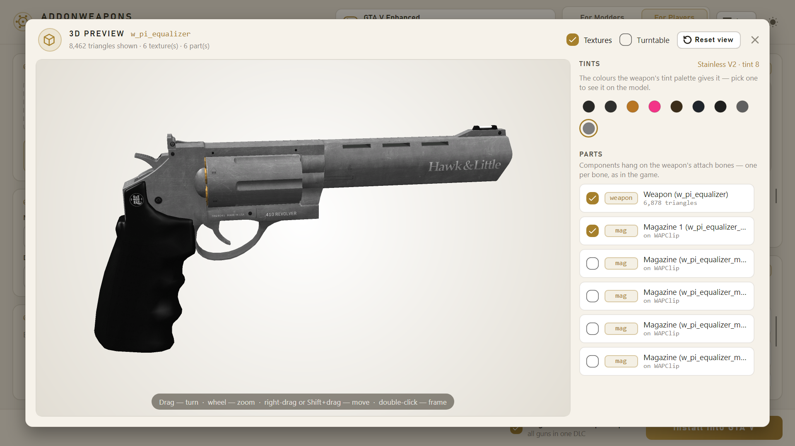
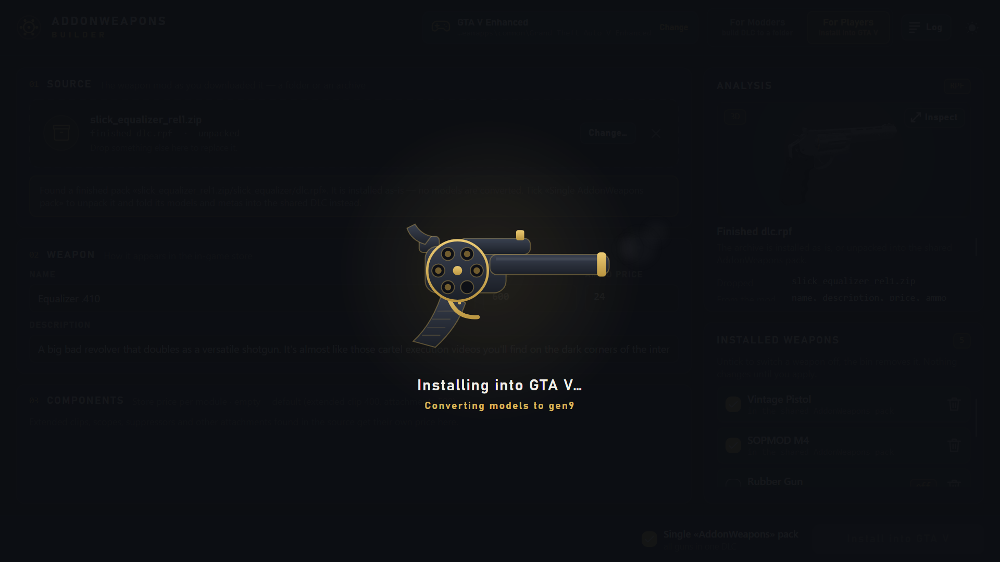
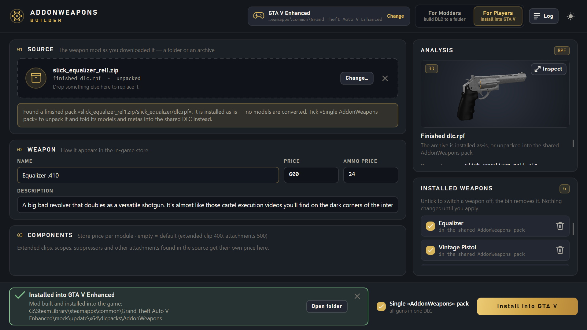
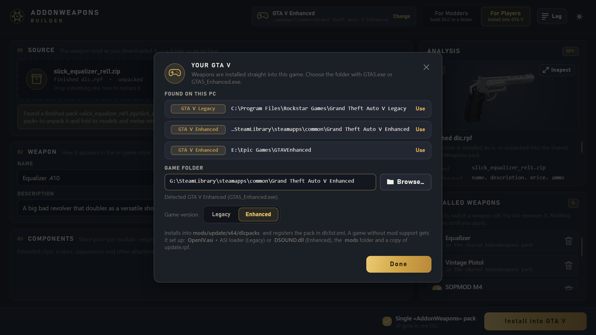
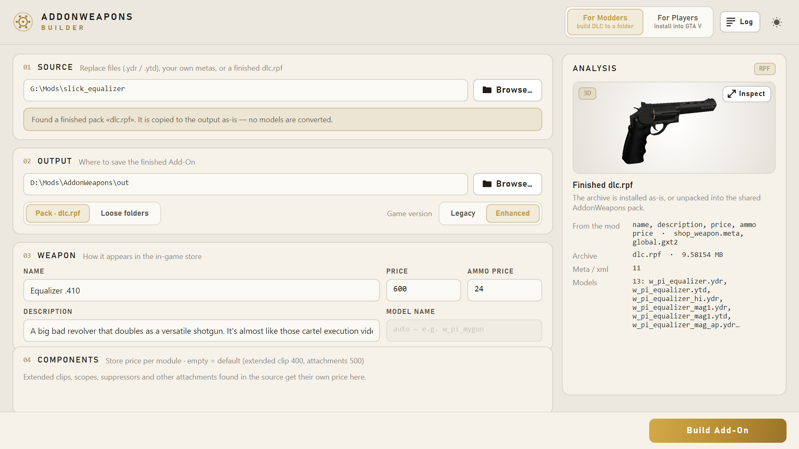
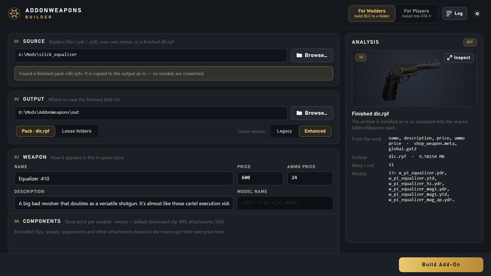

<p align="center">
  
</p>

<p align="center">
  <b>Turn any GTA V weapon mod into a real add-on weapon — and install it in one click.</b><br>
  No more replacing the vanilla Pistol or Carbine Rifle. Keep every stock gun and add as many new ones as you like.
</p>

<p align="center">
  
  
  
  
</p>

<p align="center">
  <a href="#-for-players">For players</a> •
  <a href="#-for-modders">For modders</a> •
  <a href="#-getting-started">Getting started</a> •
  <a href="#-faq">FAQ</a>
</p>

<p align="center">
  
</p>

---

## Why

Most GTA V weapon mods are **replacements**: the new model takes the place of a stock weapon, so the
original gun is gone and two mods for the same slot can't live together. AddonWeapons Builder takes such a
mod — exactly as you downloaded it — and turns it into a separate **add-on weapon** with its own name, store
price and attachments. The game treats it like any other DLC weapon, so it shows up in add-on weapon menus
such as the **AddonWeapons** script, right next to the vanilla arsenal.

---

## 🎮 For players

### Drop the mod. Check it. Install.

<p align="center">
  
</p>

1. **Drag the mod into the window** — the folder, or the `.zip` / `.rar` / `.7z` / `.oiv` you downloaded.
   No unpacking, no hunting for the right files.
2. **Look at it in 3D** and check the name, description and prices — they are already filled in from the mod.
3. Press **Install into GTA V**. Done — start the game and buy the weapon.

### What you get

- **🔫 Keep every vanilla weapon.** Mods are installed as new weapons, never over the stock ones. Install
  ten revolvers if you want — they don't conflict.
- **📦 Any download works as is.** Folders, zip, rar (incl. RAR5), 7z, OIV packages, multi-part archives and
  archives inside archives. Models and textures are found in any sub-folder; readmes, screenshots and
  "Original / Backup" folders are skipped automatically. If the mod ships a ready add-on `dlc.rpf`, that's
  what gets installed.
- **✍️ Store details filled in for you.** The weapon name, description, price, ammo price and attachment
  prices are read from the mod itself. Change anything you like before installing.
- **🧊 3D preview before you install.** Turn, zoom and inspect the weapon, switch attachments (magazines,
  suppressors, scopes, flashlights, grips) and try the weapon's **tints** — see exactly what you're getting.
- **🖱️ One-click install into GTA V Legacy _and_ Enhanced.** The app finds your game automatically (Rockstar
  Games Launcher, Steam, Epic Games) and detects which edition it is. Mods made for the old game are
  converted for **Enhanced** on the fly.
- **🧹 Works on a clean game.** No mod setup yet? The app prepares it for you: the `mods` folder, the mod
  loader for your edition and everything the game needs to load add-on weapons. Your original game archives
  are not modified — all changes go into the `mods` folder.
- **🗂️ One tidy pack for everything.** All weapons you install go into a single shared *AddonWeapons* DLC
  instead of dozens of separate packs.
- **✅ Switch weapons on and off.** The *Installed weapons* list shows everything you added. Untick a weapon
  to disable it, press the bin to remove it — nothing changes in the game until you press *Apply*.

<table>
  <tr>
    <td width="50%"></td>
    <td width="50%"></td>
  </tr>
  <tr>
    <td align="center"><sub>Inspect the model, attachments and tints</sub></td>
    <td align="center"><sub>Light and dark themes</sub></td>
  </tr>
  <tr>
    <td width="50%"></td>
    <td width="50%"></td>
  </tr>
  <tr>
    <td align="center"><sub>Installing — the revolver keeps you company</sub></td>
    <td align="center"><sub>Installed, and ready to switch on or off</sub></td>
  </tr>
</table>

<p align="center">
  
  <br><sub>Your GTA V installs are found automatically — Legacy or Enhanced, Rockstar, Steam or Epic</sub>
</p>

---

## 🛠️ For modders

Switch to **For Modders** and the same engine builds a complete add-on DLC into a folder of your choice —
ready to publish, or to open in CodeWalker.

<table>
  <tr>
    <td width="50%"></td>
    <td width="50%"></td>
  </tr>
</table>

- **From replace files to a finished add-on.** Give it the `.ydr` / `.ytd` of a replace mod and it generates
  the whole data stack: `weapons.meta`, components, archetypes, animations, shop and loadout entries,
  `content.xml`, `setup2.xml` and the text labels (`global.gxt2`). Stats and handling come from the matching
  vanilla weapon — 133 stock weapons are covered, with class-based templates for the rest.
- **No name collisions.** Models and all identifiers are moved into a unique namespace, so the add-on never
  clashes with vanilla content or with other add-ons. Or set your own model name (`w_pi_mygun`).
- **Your metas win.** Ship your own `.meta` / `.xml` files and they go into the pack byte for byte; only the
  missing pieces are generated, with names that match yours. Files are recognised by content, not by
  extension — `weapons.meta.txt` works too.
- **Attachments with prices.** Magazines, suppressors, scopes, flashlights, grips and barrels found in the
  source are wired up as components, each with its own store price.
- **Legacy or Enhanced output.** Build for either edition. For Enhanced, models are converted to the gen9
  format and every converted resource is verified.
- **Packed or loose.** Get a ready `dlc.rpf` or open folders to tweak and pack yourself. Every packed archive
  is self-checked before it's handed to you, so a broken resource never ships.
- **Know before you build.** The *Analysis* panel shows how the source will be built, the main model, the
  base weapon, hi-LOD models, components and any warnings — plus a 3D preview of the model with its
  attachments and tint palette, straight from the files or from a finished `dlc.rpf`.
- **Command line included.** `awbctl` ships next to the app for scripting and batch builds:

  ```bash
  awbctl build data/templates <input_folder> <out_dir> --name "Vintage Pistol" --price 45000 --edition enhanced
  awbctl verify <archive.rpf>
  ```

  Run `awbctl` without arguments for the full list of commands and options.

---

## 🚀 Getting started

1. Download `AddonWeaponsBuilder-<version>-win-x64.zip` from the [Releases](../../releases) page.
2. Unzip it anywhere and run **`AddonWeaponsBuilder.exe`**. There is no installer and nothing else to set up —
   .NET is bundled.
3. Pick **For Players** to install weapons into your game, or **For Modders** to build a DLC into a folder.

**You need:** Windows 10 or 11 (x64) and GTA V for PC — Legacy or Enhanced. To buy and equip add-on weapons
in the game, use a menu that lists DLC weapons, for example the **AddonWeapons** script.

---

## ❓ FAQ

<details>
<summary><b>Will it break my game or overwrite my files?</b></summary>

No. Weapons are installed into the `mods` folder, and the original game archives stay untouched. To undo an
install, remove the weapon in the *Installed weapons* list.
</details>

<details>
<summary><b>Do I need OpenIV or a mod loader?</b></summary>

No. If the game has no mod support yet, the app sets it up during the first install — with the right loader
for Legacy or Enhanced. If a `mods`-folder loader that suits your edition is already there (OpenIV.asi,
RageOpenV, OpenRPF and similar), it's left as it is.
</details>

<details>
<summary><b>The mod I downloaded is for Legacy, but I play Enhanced. Will it work?</b></summary>

Yes. Models made for the old game are converted for Enhanced automatically while installing. (The other way
round — Enhanced-only models into Legacy — isn't possible.)
</details>

<details>
<summary><b>Can I use it in GTA Online?</b></summary>

No — add-on weapons are for story mode. Don't go online with a modded game.
</details>

<details>
<summary><b>Where are the weapons in the game?</b></summary>

Add-on weapons are real DLC weapons, so they appear in menus that list DLC weapons, such as the AddonWeapons
script.
</details>

<details>
<summary><b>Something went wrong — where do I look?</b></summary>

Press **Log** in the top bar to see what happened during the last build or install. The full log file is one
click away from there — attach it when reporting a problem.
</details>

---

## 🙏 Credits

- [CodeWalker](https://github.com/dexyfex/CodeWalker) by dexyfex — resource reading and gen9 conversion.
- **OpenIV.asi** by the OpenIV team and the **ASI Loader** by Alexander Blade — mod support for GTA V Legacy.
- **Simple Mods Loader** (`DSOUND.dll`) by NativeCoder — mod support for GTA V Enhanced.

Grand Theft Auto V is a trademark of Take-Two Interactive / Rockstar Games. This project is not affiliated
with or endorsed by them.
